<p align="center">
  
</p>

<p align="center">
  <a href="#running-locally"></a>
  <a href="https://github.com/itaygoldenberg/rag-document-answers"></a>
  <a href="https://github.com/itaygoldenberg?tab=repositories"></a>
  <a href="https://www.linkedin.com/in/itay-goldenberg/"></a>
</p>

<p align="center">
  <a href="#overview">Overview</a>&nbsp;&middot;&nbsp;
  <a href="#features">Features</a>&nbsp;&middot;&nbsp;
  <a href="#workflow">Workflow</a>&nbsp;&middot;&nbsp;
  <a href="#technology">Technology</a>&nbsp;&middot;&nbsp;
  <a href="#running-locally">Running locally</a>
</p>

> [!NOTE]
> A full-stack course portfolio project by Itay Goldenberg. Retrieve passages from local documents before generating an answer.

## Overview

RAG Document Answers combines an Express API, a React question interface and a local LlamaIndex vector store. An indexing command reads documents, creates overlapping chunks and persists embeddings. At question time the API retrieves relevant passages and sends them to OpenAI as context.

The answer response includes both the generated answer and the retrieved chunks, making the supporting material available to the client. The prompt instructs the model to say it does not know when the documents lack the answer; this is an instruction rather than a factual guarantee.

<table><tr><td align="center" width="25%"><strong>512 / 128</strong><br /><sub>chunk size / overlap</sub></td><td align="center" width="25%"><strong>TOP 4</strong><br /><sub>retrieved results</sub></td><td align="center" width="25%"><strong>EXPRESS</strong><br /><sub>three POST routes</sub></td><td align="center" width="25%"><strong>REACT</strong><br /><sub>question interface</sub></td></tr></table>

| Project detail | Implementation |
|---|---|
| LlamaIndex | Document reading, chunking, embedding and retrieval |
| OpenAI | Embedding and answer generation |
| Express + TypeScript | Index, retrieval and answer endpoints |
| React + Axios + Vite | Question interface and API requests |

## Contents

- [Overview](#overview)
- [Features](#features)
- [Workflow](#workflow)
- [Technology](#technology)
- [Project structure](#project-structure)
- [Running locally](#running-locally)
- [Checks](#checks)
- [Additional details](#additional-details)
- [Operational notes](#operational-notes)
- [Author](#author)

## Features

### Separate indexing step

`npm run embed` reads `backend/src/assets/docs` and persists a local store under `backend/src/assets/vector-db`.

### Semantic retrieval

The retriever embeds the question and requests four results, including chunk text and similarity scores.

### Context-based generation

The answer route supplies retrieved passages in the system prompt and returns `{answer, chunks}`.

### Inspectable retrieval API

A separate chunks endpoint lets callers inspect retrieval without asking for a generated answer.

## Workflow

<p align="center">
  
</p>

1. **LOCAL DOCUMENTS:** Read source files and split into chunks.
2. **VECTOR STORE:** Persist embeddings with LlamaIndex.
3. **QUESTION RETRIEVAL:** Find the top four matching passages.
4. **CONTEXT + ANSWER:** Send passages to GPT return answer + chunks.

## Technology

<p align="center">
  
</p>

| Technology | Role |
|---|---|
| LlamaIndex | Document reading, chunking, embedding and retrieval |
| OpenAI | Embedding and answer generation |
| Express + TypeScript | Index, retrieval and answer endpoints |
| React + Axios + Vite | Question interface and API requests |

## Project structure

```text
backend/src/ai/               Indexing and retrieval
backend/src/assets/docs/      Source documents
backend/src/assets/vector-db/ Generated local store (ignored)
backend/src/controllers/      Index, chunks and answer routes
frontend/src/                 React question interface
docs/                         README artwork
```

## Running locally

Clone the repository, then follow the application-specific steps below. Commands assume the repository root unless a directory change is shown.

```bash
git clone https://github.com/itaygoldenberg/rag-document-answers.git
cd rag-document-answers
```

```bash
cd backend
```

Copy `.env.example` to `.env` in this application directory and configure it before starting:

```env
OPENAI_API_KEY=your_openai_api_key
PORT=4300
```

Place the documents to index in `src/assets/docs`, then run:

```bash
npm install
npm run embed
npm start
```

In a second terminal, starting from the repository root:

```bash
cd frontend
```

```bash
npm install
npm run dev
```

Open the local address printed by Vite. The frontend targets `http://localhost:4300`. Wait for the backend to finish loading its vector store before sending a question.

## Checks

Run `npm run build` separately in `backend` and `frontend`. After indexing, ask a question covered by a document and inspect the returned chunks; then ask one outside the corpus and inspect the model response. These manual checks require API access.

These are available build commands and suggested manual checks, not a claim that a full integration test suite is included.

## Additional details

| Method | Route | Purpose |
|---|---|---|
| POST | `/api/vector-db` | Rebuild the local index |
| POST | `/api/chunks` | Retrieve chunks for `{ "question": "..." }` |
| POST | `/api/ask` | Return answer and chunks for the same body |

## Operational notes

Indexing and questions use OpenAI API calls. Rebuild after changing source documents and restart the backend so its in-memory retriever reloads the store. The vector store is generated and ignored by Git. Keep the index route local unless access control is added; retrieved context improves grounding but does not guarantee correct answers.

## Author

<p align="center">
  <strong>Itay Goldenberg</strong><br />
  <sub>Full Stack Developer Student &middot; John Bryce</sub>
</p>

<p align="center">
  <a href="https://github.com/itaygoldenberg"></a>
  <a href="https://www.linkedin.com/in/itay-goldenberg/"></a>
</p>
