<p align="center">
  
</p>

<p align="center">
  <a href="#running-it"></a>
  <a href="https://github.com/itaygoldenberg/rag-document-answers"></a>
  <a href="https://github.com/itaygoldenberg?tab=repositories"></a>
  <a href="https://www.linkedin.com/in/itay-goldenberg/"></a>
</p>

> [!NOTE]
> Retrieval-Augmented Generation: the model answers from documents you supply, and only from those.

<p align="center">
  <a href="#overview">Overview</a>&nbsp;&middot;&nbsp;
  <a href="#features">Features</a>&nbsp;&middot;&nbsp;
  <a href="#technology">Technology</a>&nbsp;&middot;&nbsp;
  <a href="#project-structure">Project structure</a>&nbsp;&middot;&nbsp;
  <a href="#running-it">Running it</a>&nbsp;&middot;&nbsp;
  <a href="#notes">Notes</a>
</p>

## Overview

A language model answers from what it was trained on. Ask it about a document it has never seen and it will either refuse or invent something plausible. RAG closes that gap by finding the relevant passages first and putting them into the prompt as context.

The indexing step is separate and deliberate. `npm run embed` reads the documents, splits them, turns each chunk into a vector and writes a local store. At request time the question is embedded the same way, the nearest chunks come back, and only those go to the model.

| Project detail | Implementation |
|---|---|
| Indexing | `npm run embed` reads `src/assets/docs`, writes `src/assets/vector-db` |
| Retrieval | Question embedded, nearest chunks returned by distance |
| Generation | The retrieved chunks become the context of the prompt |
| Backend | Express and TypeScript |
| Frontend | React and Vite, asks and displays |
| Library | LlamaIndex with OpenAI embeddings |

## Contents

- [Overview](#overview)
- [Features](#features)
- [Technology](#technology)
- [Project structure](#project-structure)
- [Running it](#running-it)
- [Notes](#notes)

## Features

### Answers grounded in your documents

The model is given the passages that matched, so the answer comes from the source rather than from memory. Ask about something that is not in the documents and it has nothing to draw on.

### Meaning, not keywords

Embedding turns text into a list of numbers positioned so that similar meanings sit close together. Finding relevant text becomes a distance calculation, which is why a question worded differently from the document still finds it.

### Indexing is a separate step

Building the vector store is slow and costs tokens, so it runs once with `npm run embed` and not on every question. Change the documents and run it again.

### A generated store, not a committed one

`src/assets/vector-db` is produced from the documents and stays out of the repository. The documents are the source of truth.

## Technology

<p align="center">
  
</p>

| Technology | Role |
|---|---|
| LlamaIndex | Chunking, embedding and the vector store |
| OpenAI | Embeddings and the answer |
| TypeScript | Backend and frontend |
| Node.js + Express | The API |
| Axios | HTTP client |
| React + Vite | The client |

## Project structure

```text
RAG/
|-- backend/
|   |-- src/ai/              indexing and retrieval
|   |-- src/assets/
|   |   |-- docs/            the source documents
|   |   `-- vector-db/       generated by npm run embed, not committed
|   |-- src/controllers/
|   `-- src/services/
|-- frontend/                asks the question, shows the answer
`-- docs/                    README artwork only
```

## Running it

```bash
cd backend
```

```bash
npm install
```

Build the vector store once, before the first question:

```bash
npm run embed
```

```bash
npm start
```

Then, in a second terminal:

```bash
cd frontend
```

```bash
npm run dev
```

## Environment

Copy `.env.example` to `.env` and fill in your own values:

```env
OPENAI_API_KEY=your_openai_api_key
```

`.env` is ignored by git. A key that reaches GitHub is public from the moment it is pushed.

## Notes

- `npm run embed` has to run before the first question. Without a vector store there is nothing to retrieve, and the answer route fails rather than guessing.
- Re-run it after changing anything under `src/assets/docs`. The store is a snapshot, not a live view.
- How many chunks are retrieved is a trade-off: too few and the answer misses context, too many and the important passage is diluted.

## Author

<p align="center">
  <strong>Itay Goldenberg</strong><br />
  <sub>Full Stack Developer Student &middot; John Bryce</sub>
</p>

<p align="center">
  <a href="https://github.com/itaygoldenberg"></a>
  <a href="https://www.linkedin.com/in/itay-goldenberg/"></a>
</p>
